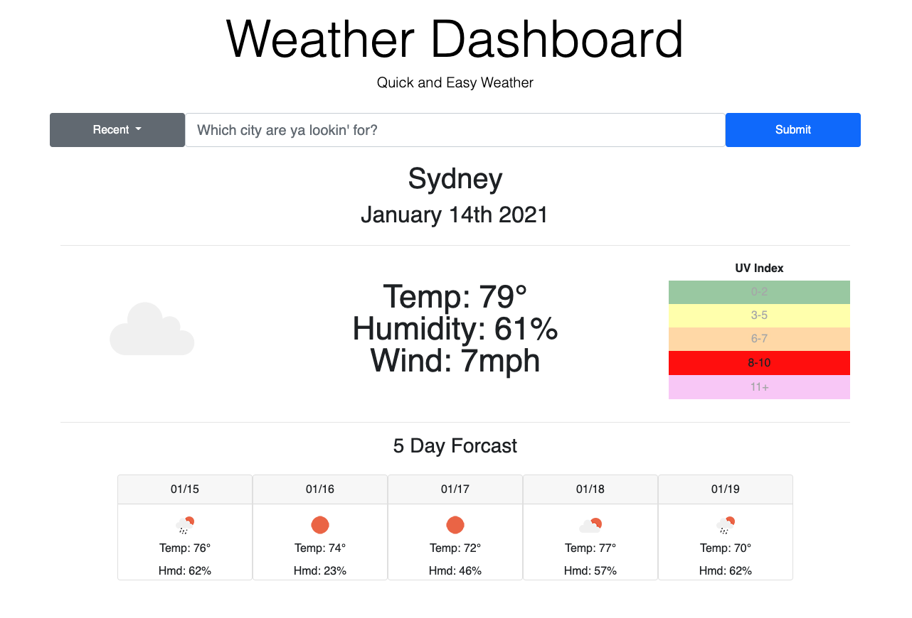
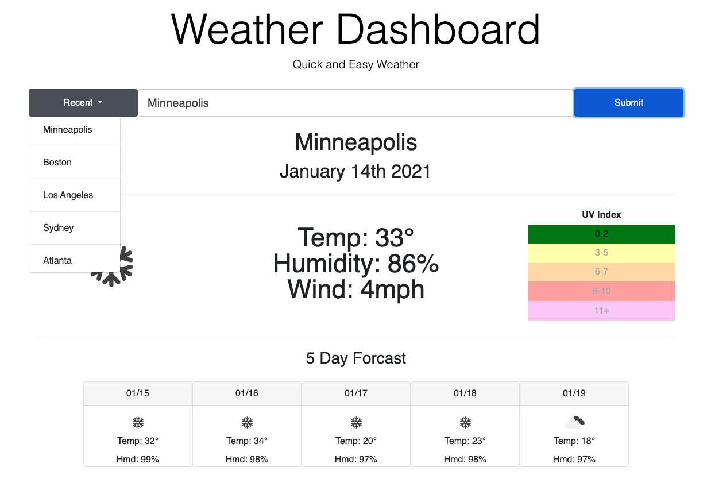

# Weather Dashboard
A quick and easy weather dashbboard that shows you the current weather and 5 day forcast for a user-given location. 

## Overview

Based on the given Acceptance Criteria from the customer I was able to create an app that beautifully displays the weather of a user given-location. When a location is searched the user is presented with current and future conditions for that city. The city they search for is also added to a list of previously searched cities.

When the user views the current weather conditions for the city they searched for, they are presented with the city name, the date, an icon representation of weather conditions, the temperature, the humidity, the wind speed, and the UV index. In this information they are able to quickly see the severity of the UV index based on a color coded scale.

When the user views the future weather conditions for the city they searched for, they are presented with a 5-day forecast that displays the date, an icon representation of weather conditions, the temperature, and the humidity.

When the user clicks on the recent button they will see a list appear below the button that shows their 5 most recent searches. When one of the locations are clicked, that locations current and future weather conditions are shown.

If a user were to leave the application, their last visited location will be saved for them and presented to them upon their returt.

## Links

gitHub: (https://github.com/NickStull/weather-dashboard)
Published website: (https://nickstull.github.io/weather-dashboard/)

## Screenshots:

